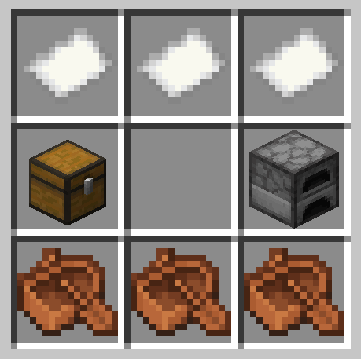

# Blimpy Mod for Minecraft NeoForge

This was a NeoForge port of [LittleLogistics](https://littlelogistics.murad.dev/) but now it only features blimps. The model is made by [pega](https://www.fiverr.com/s/38y2BGL) are published under the same license as the source code. The item icon is made by [teezeepeezee](https://www.teezeepeezee.com/).

This mod is sponsored by [Agile Unicorn](https://agile-unicorn.com/).

## How To...

### Build it?

Assemble boats, paper, a chest and a furnace.

### Load it?

Press shift + right click to access the inventory from OUTSIDE the blimp (if not mounted).

### Control it?

Press jump (space) to gain height and left ctrl to sink. Otherwise, the blimp is controlled like a boat

### Dye it?

Use any dye color (item) on the blimp when not mounted.

## License

### Source Code / java files

LGPLv3
https://www.gnu.org/licenses/lgpl-3.0.en.html

All assets are used with permission from the original authors of the Little Logistics project. 

## Development

#### Adding an entity

* create a recipe in ModRecipeProvider
* create an Entity Model (e.g. SubmarineEntity)
* register the entity in ModEntityTypes
* register the model for rendering in ModClientEventHandler
* register events in ModEventBusEvents
* register a creative mode tab in ModItems
* add an entry in ModItemModelProvider
